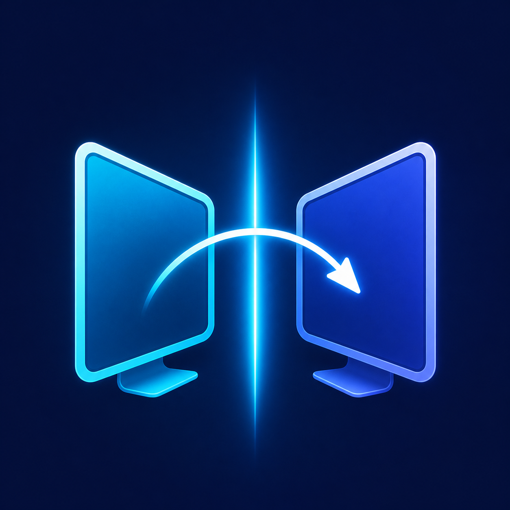

<p align="center">
  
</p>

# EdgeHop

[](https://github.com/Coraia/EdgeHop/actions/workflows/ci.yml)
[](LICENSE)

EdgeHop 是一款开源软件 KVM：使用 Mac 的键盘、鼠标或触控板控制
Omarchy/Hyprland 设备，并在两端同步剪贴板。把指针推过共享边缘即可切换，
不要求显示器支持 PBP，两台电脑各接一块独立显示器也可以使用。

## 当前支持范围

| 角色 | 支持平台 |
|---|---|
| 主机 | macOS 26、Apple Silicon |
| 客户端 | Omarchy/Arch Linux、Hyprland/Wayland、amd64 或 arm64 |
| 拓扑 | 两台设备、左右排列、单屏正式支持 |
| 网络 | 两台设备网络互通，默认 TCP `24800` |

多显示器桌面目前为实验性能力。Mac 端只跟踪主显示器，Hyprland 端只读取
第一台显示器；详细边界见 [已知问题](docs/known-issues.md)。

## 功能

- TLS 1.3 加密连接和随机共享配对密钥
- 键盘、鼠标、滚轮和剪贴板双向协作
- 贴边停留与“挣脱”交互，减少误切换
- 切换时按屏幕高度比例保持指针位置
- 菜单栏实时状态和配对码复制
- 菜单中选择“客户端在 Mac 左侧/右侧”
- Mac 作为布局单一事实源，自动同步相反返回边缘给 Linux 客户端
- Omarchy systemd 开机自启和旧版本自动迁移

## 安装

### 1. macOS

从 [Releases](https://github.com/Coraia/EdgeHop/releases) 下载：

`EdgeHop-macos26-arm64.dmg`

1. 打开 DMG，把 `EdgeHop.app` 拖入 `/Applications`。
2. 当前公开包采用 ad-hoc 签名且未做 Apple 公证。首次启动如被拦截，请在
   Finder 中右键应用并选择“打开”。
3. 在“系统设置 → 隐私与安全性 → 辅助功能”中启用 EdgeHop。
4. 从菜单栏选择“复制配对码”。

首次启动会创建：

- 配对密钥：`~/Library/Application Support/edgehop/pairing.key`
- 布局配置：`~/Library/Application Support/edgehop/config.json`
- 日志：`~/Library/Logs/EdgeHop.log`

从旧版 Universal Control 升级时，EdgeHop 会自动复制原配对密钥和配置。
由于 ad-hoc 签名身份随构建变化，升级后 macOS 可能要求重新授予辅助功能权限。

### 2. Omarchy

下载 `edgehop-omarchy-install.tar.gz`，然后运行：

```bash
tar xzf edgehop-omarchy-install.tar.gz
cd edgehop-omarchy
./setup-omarchy.sh -s <Mac-IP>
```

在隐藏提示中粘贴 Mac 菜单复制的配对码。安装器会：

- 安装所需依赖和 `/dev/uinput` 权限规则
- 选择 amd64 或 arm64 客户端
- 写入权限为 `0600` 的配对密钥
- 创建并启动 `edgehop-client.service`
- 迁移旧 `uc-client.service`、二进制和 Hyprland 设备配置

查看状态：

```bash
systemctl status edgehop-client
journalctl -u edgehop-client -f
```

## 设备布局

在 Mac 菜单栏打开“设备布局”，选择：

- `客户端在 Mac 左侧`
- `客户端在 Mac 右侧`

选择会立即保存并同步到已连接客户端，不需要分别修改两端配置。

## 从源码构建

要求 Go 1.26 和 Xcode Command Line Tools。

```bash
make test
make dmg
make omarchy-installer
```

产物：

- `dist/EdgeHop-macos26-arm64.dmg`
- `dist/edgehop-omarchy-install.tar.gz`

命令行入口：

```bash
go run ./cmd/edgehop-server -h
go run ./cmd/edgehop-client -h
```

## 安全模型

EdgeHop 不使用云端服务。双方通过用户复制的随机 256 位密钥完成认证，
连接使用 TLS 1.3，并以 TLS 导出密钥材料绑定双方 HMAC 证明。配对密钥不会
写入命令行参数、shell 历史或应用日志。

请勿公开上传本机配对密钥、配置或日志。

## 已知限制

- macOS 系统级 Mission Control 手势无法通过 CGEventTap 完全拦截。
- LUKS 根分区解锁前，Linux 客户端和网络尚不可用。
- 完整多显示器拓扑管理尚未实现。
- 当前 DMG 未使用 Developer ID 签名或 Apple 公证。

更多信息见 [`docs/known-issues.md`](docs/known-issues.md)。

## 贡献与安全

- 贡献指南：[`CONTRIBUTING.md`](CONTRIBUTING.md)
- 安全问题：[`SECURITY.md`](SECURITY.md)
- 变更记录：[`CHANGELOG.md`](CHANGELOG.md)

## License

[MIT](LICENSE) © 2026 Coraia
